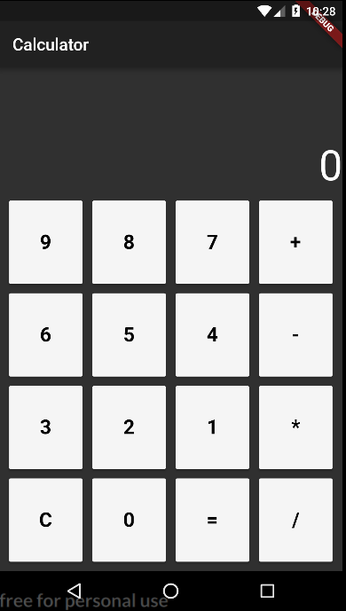

# calcapp

A simple calculator app made using Flutter

## Getting Started

You can find the tutorial [here](https://medium.com/@harshil1712/lets-flutter-how-i-built-a-simple-calculator-with-flutter-41410b76a1aa)

Clone the repo and run `flutter run` to run the application on your device or emulator.

Here's the screenshot of the application:

